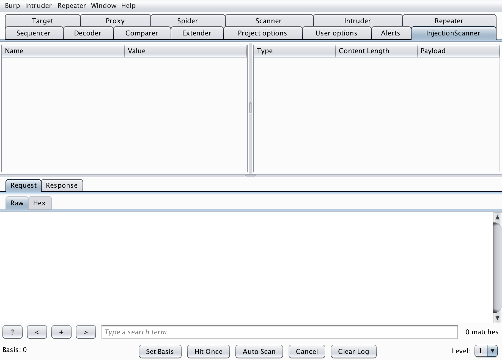
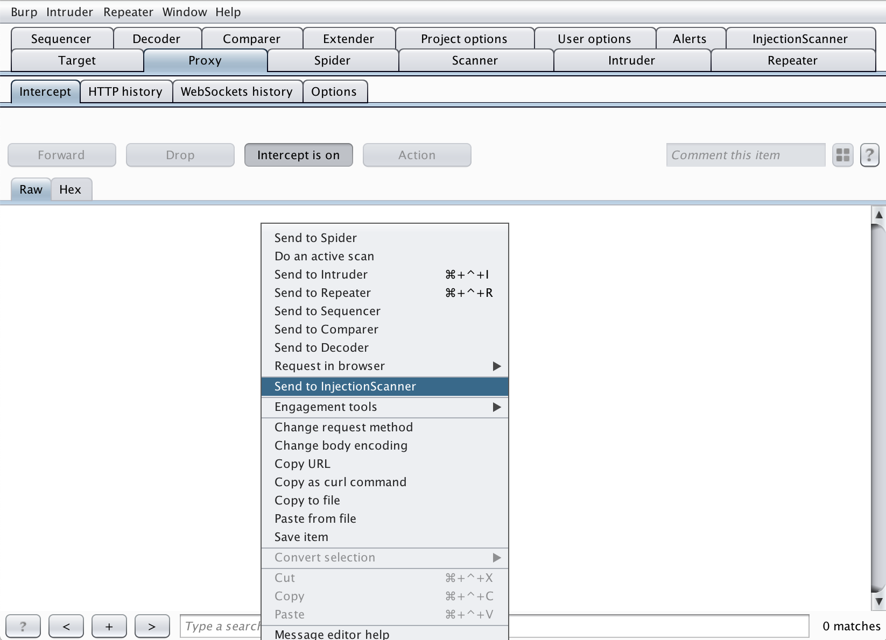

# InjectionScanner
A Burp Extension for finding simple SQL exploitable. Supports GET and POST with key-value, Json and XML data type.

The extension will automatically fetch the data and variables within the URL/data section for users to customize.

## Screenshots

## Usage
### UIs

**Upper Left Panel:** 
* Fetched data will be shown here for users to customize, including data, User-Agent, URL, etc.

**Upper Right Panel:**
* Shows the log of each send/receive. User can click on the log to see detail.

**Lower Panel:**
* Showes the detail of selected log.

### Buttons

**Set Basis:**
* Set the currently selected log's content-length to the basis, usually the default content-length.

**Hit Once:**
* Using the content shows in the upper left panel, send the package and waiting for response.

**Auto Scan:**
* Using current level configuration (lower right selection bar), perform auto scan for possible injection.

**Cancel:**
* Force terminate current package waiting procedure, usually used when the Hit Once/Auto Scan button stucks.

**Clear Log:**
* Clear the log panel (upper right panel).

### Others
* Abnormal content length will be printed to std-out.
